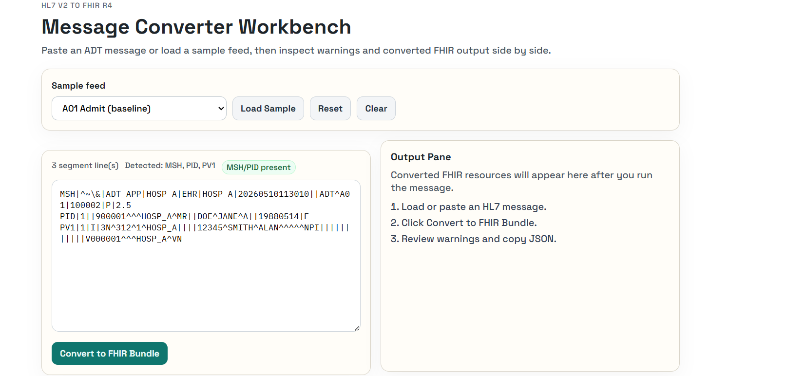
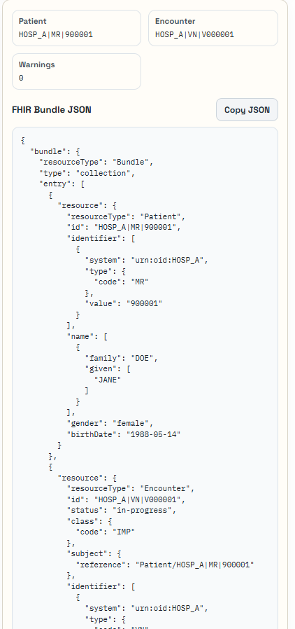
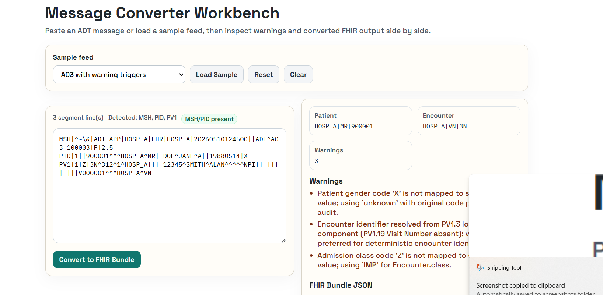

# HL7 v2 to FHIR Converter MVP

## What This Does

This project helps turn older hospital event messages into a modern FHIR R4 format that is easier for newer systems to use.

In plain English:
- you paste in an HL7 v2 ADT message,
- the app reads the important parts,
- it converts the data into FHIR Patient and Encounter resources,
- it shows the result as readable JSON,
- and it warns you when something looks incomplete, ambiguous, or unmapped.

## Why It Matters

Hospitals still rely on HL7 v2 for admissions, discharges, and patient updates. That works, but it can be messy:
- different systems use different local codes,
- identifiers can clash across facilities,
- and integration issues are often hidden until something breaks downstream.

This app shows one practical way to make that data easier to understand, safer to normalize, and more visible for teams modernizing toward FHIR.

## Who It’s For

- hospital IT and interoperability teams,
- interface engine owners,
- integration engineers,
- and non-technical stakeholders who want to see how HL7 becomes FHIR.

## Project docs

- [Product](Product.md) - business problem, product goal, and implementation rationale.
- [Production Test Feed](PRODUCTION_TEST_FEED.md) - production-like HL7 samples and validated expected outcomes.

## Screenshots

### 1) Workbench (Input + Output Layout)



### 2) Clean Success Conversion



### 3) Warning-Heavy Conversion



## Tech stack

- Backend: Python + FastAPI
- Frontend: React (Vite)
- Storage: none

## Run locally

Backend:

```bash
pip install -r requirements.txt
uvicorn app.main:app --reload
```

Frontend:

```bash
cd frontend
npm install
npm run dev -- --host 127.0.0.1 --port 5173
```

Open `http://127.0.0.1:5173`.

## How To Try It

1. Open the UI in your browser.
2. Choose a sample feed or paste your own HL7 message.
3. Click Convert to FHIR Bundle.
4. Review the warnings and the FHIR JSON output.
5. Use the side-by-side layout to compare input and output.

## Test

```bash
pytest -q
```

## Notes

- The app is intentionally local-first so it can be tested safely.
- Mapping is not fully automatic for every real-world hospital variation, so warnings are part of the design.
- The goal is to make HL7-to-FHIR conversion easier to understand, easier to demo, and easier to improve.
